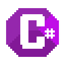

# **Shalom**, **Hello** and **Salutations**, I’m **David Kozdra** 👋

Central Florida–based Full Stack Software Engineer with over 3 years of professional experience.  
I build web applications, mobile apps, PWAs, and backend data-aggregation platforms to **empower organizations to succeed**.

# Skills

        

                    

---

## 🚧 Current Focus / Goals

- Django development and using webrtc
- Developing the **WinTest** Chrome extension — [Install on Chrome Web Store](https://chromewebstore.google.com/detail/wintest/ckgcnleaajonjljmfbamgpffiemninbe)  
- Pursuing a new full-stack MERN or Python role  

---

## 🧑‍💻 Featured Projects

### 🌐 [Portfolio Website](https://davidkozdra.com)  
**Tech:** HTML · CSS · JavaScript  
**Highlight:** Served 50 000+ visits/month with < 100 ms TTFB  

### 📈 [Real-Time Stock Portal](https://redchip.com/stocks)  
**Tech:** PHP · Python · Flask · Docker  
**Highlight:** Processes 10 000+ price updates per second  

### 🤖 [RedChat AI SEC Summarizer](https://red.chat)  
**Tech:** React · AWS Lambda · FastAPI · NLP  
**Highlight:** 24/7 summarization of all new SEC filings  

### 📱 Promo Mobile App  
**Tech:** React Native · Node.js · MongoDB  
**Highlight:** 4.8★ average rating on iOS & Android  

---

## 📊 GitHub Stats

     

---

## 📫 Connect With Me

  

